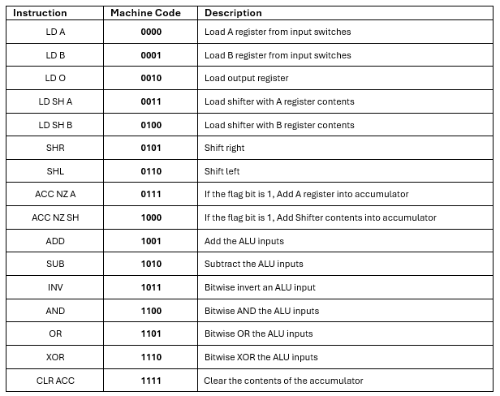
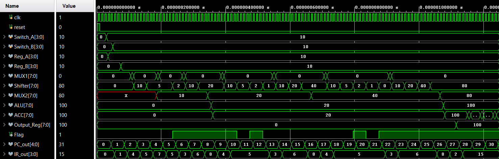

# 4-Bit Microprocessor
A 4-Bit Microprocessor in .Verilog capable of multiplying two 4-bit unsigned integers via Shift-and-Add using a custom 16-instruction ISA

The Overall System Architecture & Instruction Set Architecture (ISA) is shown below:       
`Overall System Architecture`


`Instruction Set Architecture (ISA)`



## Modules Included
### Top Module 
**Integrated Top Module.v** - Connects Control Unit and Datapath
### Control Unit 
**PC.v**  - Program Counter                                                           
**ROM.v** - Read-only Program Memory                                                 
**IR.v**  - Instruction Register                                                      
**Decoder.v** - 4-bit Instructuin Decoder                                             
**Ring Counter.v** - Timing FSM for Instruction Cycle                                
**Control Unit.v** - Generate 16-bit Control Signal
### Datapath 
**ALU.v** - Supports ADD, SUB, INV, AND, OR, XOR                                   
**ACC.v** - Accumulator for Temporary Results                                     
**Shifter.v**  - Logical LEFT/RIGHT Shifter                                       
**Register.v** - General Purpose 4-bit Registers (Input A and B and Output Register)                                             
**MUX1.v & MUX2.v** - Multiplexers for Routing                                    

## Tools Used:
**Xilinx Nexys4 DDR** – FPGA implementation                                                                                           
**Vivado 2024.2** – Simulation, Synthesis and Testbenching                             

## Testbech 
This project includes a testbench to verify the Multiplication process:                
**tb_Integrated_Top_Module** – Provides input stimuli, generates clock/reset signals, and observes internal signals such as the accumulator, ALU output, and control signals

**Simulation Waveform**                                                                                                               
Below is the behavioral simulation output of Shift-and-Add Multiplication of two 4-bit Unsigned Integers: 10 × 10 = 100
- Proper loading of Input Switches (A = 10, B = 10)
- Correct instruction Decoding and Control Flow
- ACC accumulating intermediate products
- ALU and Shifter responding to Control Signals

`Waveform Output`



## Quick Start Guide
Follow these steps to clone, simulate, and (optionally) synthesize the project

### 1. Clone the Repository
git clone https://github.com/kierancyh/4-bit-Microprocessor.git

### 2. Open in Vivado
**1. Launch Vivado 2024.2**    

**2. Create a New RTL Project**                                                       
- Name your project
- Select "Do not specify sources at this time"
                                 
**3. After project setup**                                                        
- Go to Add Sources
- Add all .v files from the src/ folder
- Add the testbench file from the testbench/ folder
                                 
**4. Set Integrated_Top_Module.v as the Top Module**

### 3. Run Behavioral Simulation
**1. In the Flow Navigator, go to** 

Simulation → Run Simulation → Run Behavioral Simulation    

**2. Use the waveform viewer to inspect key signals such as**                        
- Component Outputs
- Control Signals per clock cycle
- Accumulated Result per clock cycle

## Folder Structure
```plaintext
4-bit-Microprocessor/
├── README.md                         # Project overview and documentation
├── LICENSE                           # MIT License
├── .gitignore                        # Git exclusion rules for Vivado, etc.
├── Waveform.png                      # Screenshot of simulation results
├── ISA.png                           # Instruction Set diagram
├── Overall System Architecture.png   # Datapath + Control Unit diagram
├── src/                              # All Verilog source files
│   ├── ALU.v
│   ├── ACC.v
│   ├── ControlUnit.v
│   ├── ROM.v
│   ├── IR.v
│   ├── PC.v
│   ├── MUX1.v
│   ├── MUX2.v
│   ├── Register.v
│   ├── Shifter.v
│   ├── Decoder.v
│   ├── DataPath.v
│   └── Integrated_Top_Module.v
├── testbench/                        # Testbench files
│   └── tb_Integrated_Top_Module.v
```

## License
This project is released under the MIT License

